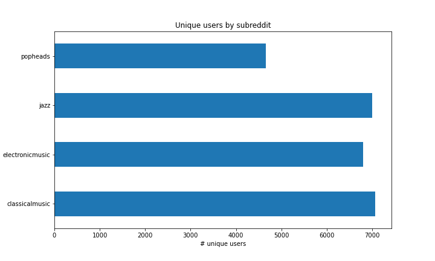
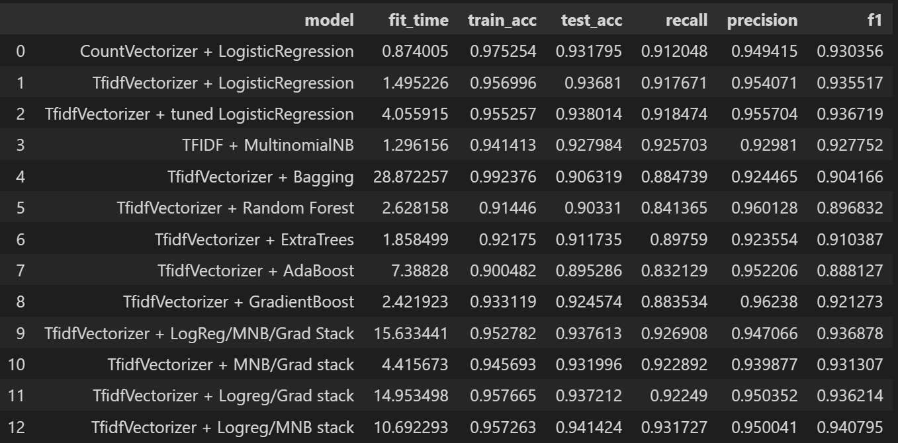

## GenreBot : Using Natural Language Processing in Music Marketing


**BACKGROUND**

As a Spotify cross-genre marketing analyst, it's my job to stay on top of the content that's trending on the music scene, and to employ my knowledge to provide the best, most relevant content to Spotify listeners in their high-affinity genres. One of the ways I learn about what's hot right now is by scanning aggregated social media feeds from a variety of sources, using tools such as [Sprout](https://sproutsocial.com).

However, I'm finding that the amount of content I need to survey is prohibitively large, and is not broken down in a way that corresponds to my genre markets. I need a better, automated way to ingest social media text content in a platform-agnostic way, tag it to the most relevant genre, and extract the top trending content. In addition to informing my marketing campaigns, this information can be passed on to my colleagues developing and maintaining our recommendation engine, enhancing the relevance of their results.


**PROPOSED SOLUTION**

I know that there is a [PushShift API](https://github.com/pushshift/api) that will allow me to download Reddit posts, tagged to their respective subreddits. I want to use this Reddit data as the training material for GenreBot, my new genre identification and content extraction engine. For my first foray into Natural Language Processing (NLP), I will:
- use the PushShift API to download posts from 2 (or more) music-related subreddits
- clean that data using regular expressions and other text manipulation utilities
- explore the content of that data to better understand it
- employ a broad spectrum of NLP tools and machine learning to train the most accurate model I can
- use my production model to predict the genre for each new post I receive, and incorporate the text from the post into my genre-tagged corpus so that I can extract updated trending words and phrases


**WHAT SUCCESS LOOKS LIKE**

By the end of this machine learning project, I want to arrive at a model that will accurately predict the relevant genre of a given post at a rate of 80% or above, selecting from 2 possible subreddits. I then want to be able to extract the top 10 trending words and phrases from the updated corpus for each genre to use in our marketing and recommendation efforts.


**DATA DICTIONARY**

Please see the [PushShift API](https://github.com/pushshift/api) for full details on the fields available for posts. However, for this particular project, we're going to retrieve:

| field        | data type | description                                              |
| ------------ | --------- | -------------------------------------------------------- |
| subreddit    | string    | name of subreddit post is from (our target class)        |
| id           | string    | unique ID of post                                        |
| title        | string    | title text of post (part of our features)                |
| author       | string    | unique ID of post author                                 |
| created_utc  | int       | UNIX epoch of post create time                           |
| score        | float     | Reddit score for the post                                |
| selftext     | string    | text of the post (part of our features)                  |
| num_comments | int       | # of comments post has received                          |


**DATA ACQUISITION** (Notebook is [here](./notebooks/01_data_acquisition.ipynb))

The overall approach here was:
- Filter out video-only and repost-only posts from all consideration (not that useful for text analysis)
- Find the start and end epochs for the subreddit's lifetime (i.e., the created_utc of the first post and the latest post)
- Divide the lifetime interval into 20 equal partitions for sampling
- From each partition, pull a set of posts that is proportional to the amount of activity during the partitioned period, chunking into sets of 250 as needed to comply with API restrictions
- Create a concatenated DataFrame from all results and export to CSV

**DATA CLEANING** (Notebook is [here](./notebooks/02_data_cleaning.ipynb))

Steps taken here included:
- Converting the [deleted] and [removed] tags in the **selftext** column to empty strings
- Concatenating the **title** and **selftext** fields to create the **all_text** column
- Removing/converting to single spaces the following:
    - Unicode characters and emojis
    - HTML entities
    - literal escape characters such as **\n** or **\t**
    - URLs
    - Punctuation other than apostrophes
    - Numbers
    - Double spaces within the text, and unnecessary leading/trailing spaces
- Removing rows that now have an empty **all_text** field after all cleaning is complete
- Exporting the clean data to a new CSV
- NOTE: The choice to remove (almost) all punctuation and numbers is likely a controversial one. It suffices for this initial exploration, but it seems likely that this will be an area for further work to improve model performance.

**EXPLORATORY DATA ANALYSIS** (Notebook is [here](./notebooks/03_eda.ipynb))

The purpose of this notebook is to "play" with a few aspects of the data, helping us to hone in on the useful columns and identify any problematic data that might cause us problems when modeling. Following are summaries/examples of the explorations conducted:

BASELINE ACCURACY

The distribution of the 4 target classes was verified to be almost exactly even, with approximately 25% of each class present in the dataset.

UNIQUE USERS

We determined that we have 25,120 unique authors across the 4 genres in our dataset. Additionally, the number of unique users per genre breaks down as follows:



Some additional analysis was done on crossover users, i.e., those who post in multiple genres, but this raised no red flags in terms of disproportionate postings.

POST DISTRIBUTION OVER TIME

We took a look at how the different genres' posts were distributed over their lifetimes, looking for any patterns of interest.


Note the unique nature of the **electronicmusic** distribution compared to the others.

TEXT CHARACTERISTICS

Additional exploration and visualization of post length in characters and words was conducted, looking for any patterns of interest. An example:


CORRELATION

And finally, a heatmap was constructed, looking for any interesting correlations among potential features:


CONCLUSIONS

Although a few interesting patterns were visible during EDA, the primary outcome of this work was to identify **classicalmusic** and **jazz** as our best initial candidates for modeling, based on their similarities to each other in terms of distribution and outliers.

**MODELING** (Notebook is [here](./notebooks/04_modeling.ipynb))

15 different models were constructed to provide a wide variety of possible optimizations. Options that were considered included:
- Stemming/lemmatization prior to vectorization of text
- CountVectorizer vs TFIDF vectorization
- Several classifiers, including logistic regression, K-nearest neighbors, decision trees and tree ensembles, boosted models, and stacked models.
- Pipelines and GridSearchCV were used as appropriate for hyperparameter tuning.
- For each model, statistics on train/test accuracy, precision, recall, F1 score, and the run time of the fit of the best estimator to provide a basis for production model selection. These statistics, pictured below, were then exported to CSV for final analysis.

MODEL STATISTICS



**EXPERIMENTS** (Notebook is [here](./notebooks/04a_experiments.ipynb))

The purpose of this notebook was to conduct a couple of brief experiments indicating possible future directions in model optimization and generalization. Specifically:

- Using unsupervised learning to perform genre clustering (KMeans and DBSCAN)
- Dimensionality reduction on an existing supervised model via principal component analysis (PCA)
- Testing our production model on a 4-genre problem (i.e., generalizing to multi-class)

The results of unsupervised learning and PCA were fairly poor at this juncture - further research is needed before employing these. However, the multi-class generalization was fairly successful, with only a small drop in accuracy scores, indicating that, after some additional optimization, the production model should perform well on multiple genres.

**RESULTS AND RECOMMENDATIONS** (Notebook is [here](./notebooks/05_results.ipynb))

In this notebook, we used the collected model statistics to compare models, selecting the final production model via a weighted sum of test accuracy, inverse delta between training and testing accuracy, and inverse fit time. These factors were scaled to similar magnitudes, and then weights of 4, 2, and 1 were chosen (somewhat arbitrarily) for those 3 important model factors. Based on the final overall model scores derived here, the selected production model was:

```
tfidf = TfidfVectorizer(max_df = 0.8, max_features = 4000, stop_words = 'english')
X_vec_train = tfidf.fit_transform(X_train)
X_vec_test = tfidf.transform(X_test)

logreg = LogisticRegression(C=1, l1_ratio=0.1, max_iter=10000, penalty='elasticnet',
                   solver='saga')
mnb = MultinomialNB()

l1_estimators = [('logreg', logreg), ('mnb', mnb)]

stack = StackingClassifier(l1_estimators)
```

Once the model was selected, we used it to predict genres on the test data, making note of the misclassified documents for later analysis, and achieving our goal of extracting the top 10 words and bigrams for each genre.

For the **jazz** subreddit, the top 10 words by occurrence were:

```
jazz       2753
like        936
music       719
know        637
just        620
ve          515
really      437
looking     420
play        372
new         363
```

The top 10 bigrams for the **jazz** subreddit were:

```
miles davis       136
don know           92
big band           90
jazz music         75
does know          69
new jazz           67
john coltrane      60
jazz albums        58
charlie parker     55
feel like          54
```

For the **classicalmusic** subreddit, the top 10 words by occurrence were:

```
music        1824
classical    1108
like          803
piece         676
pieces        639
piano         552
know          545
just          510
ve            426
help          355
```

And the top 10 bigrams for **classicalmusic** were:

```
classical music     600
don know             84
piano concerto       81
sheet music          55
th century           51
feel like            51
does know            50
ve heard             49
thanks advance       46
classical pieces     45
```

A few final recommendations were made based on these results:
- Our model performs well on 2-genre problems, and experiments indicate a positive outlook for multi-genre problems.
- To improve performance, we should also invest a fair amount of time creating revised stopwords lists that remove less useful terms such as "classical music" or "like," so that we can find more salient terms.
- At this time, unsupervised learning and dimensionality reduction do not appear to offer improved models.

**PRESENTATION**

See [here](./presentation/presentation.pdf) for a brief, fairly non-technical presentation summarizing the problem, modeling process and results.